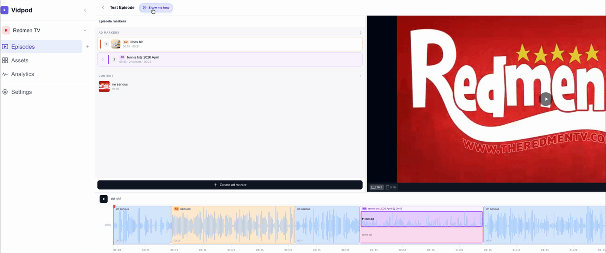
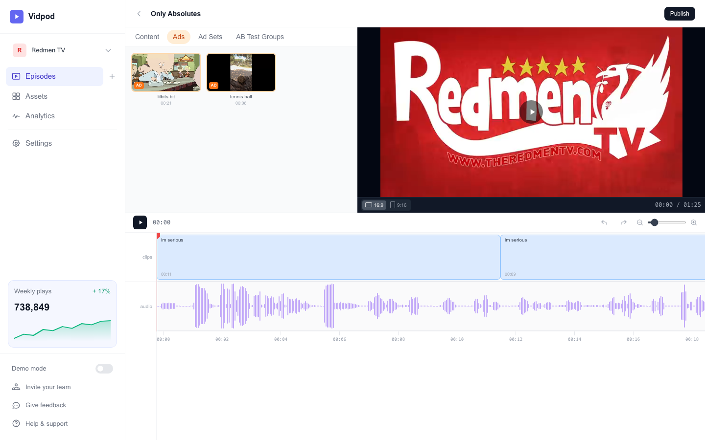
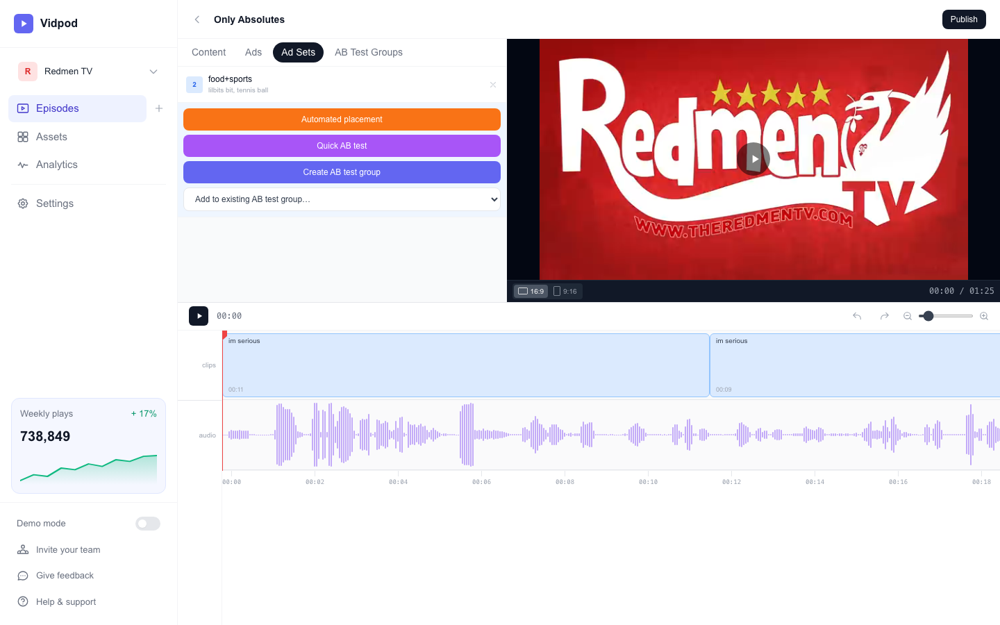
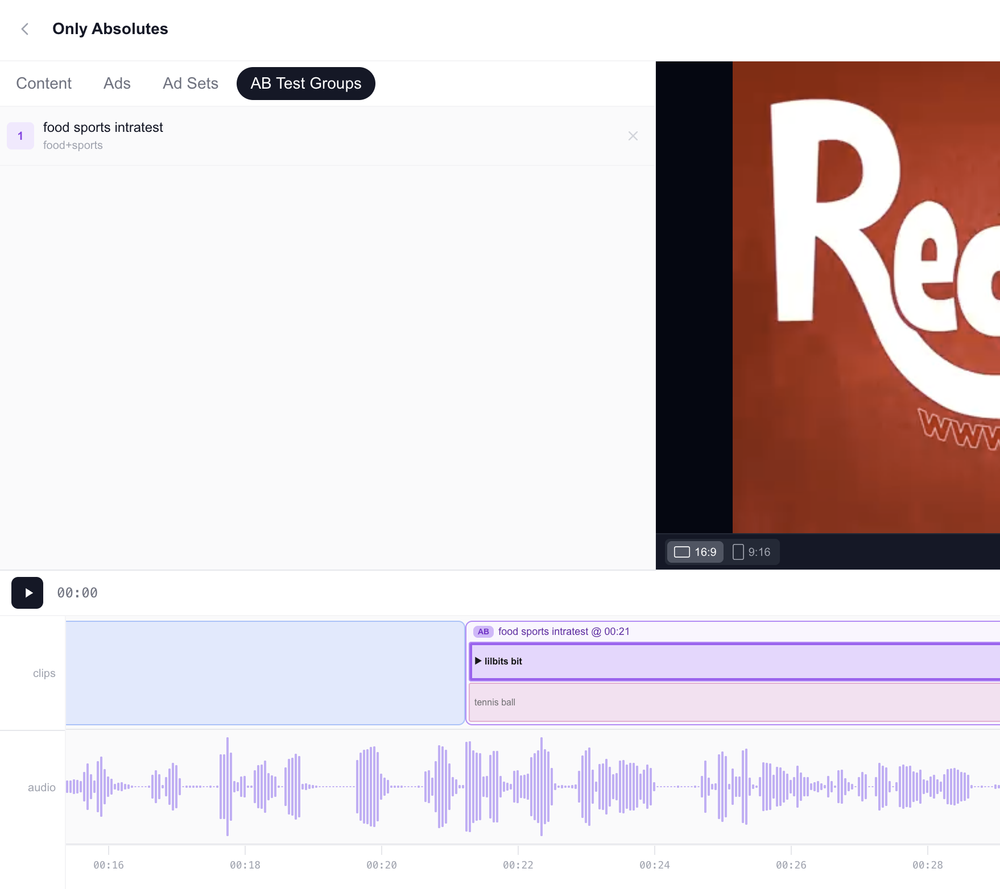
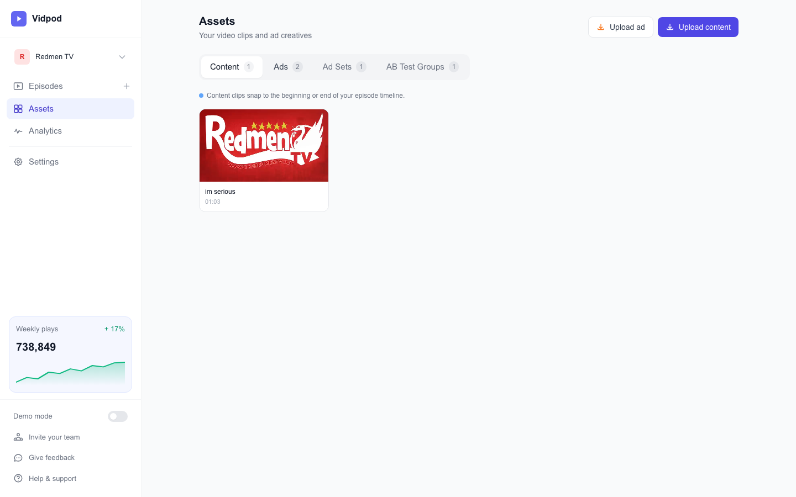
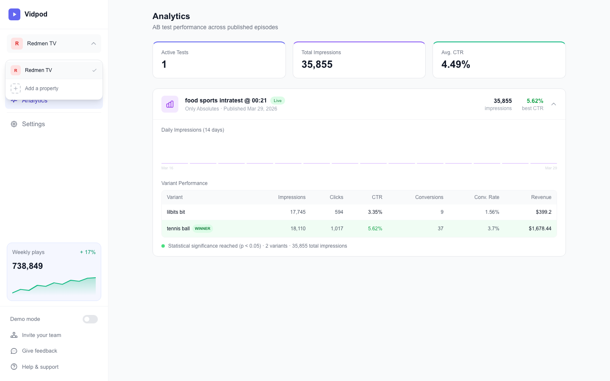

# Vidpod

Video podcast production platform with dynamic ad insertion and A/B testing.



## Core Features

### Episode Designer
Drag-and-drop timeline editor for assembling video and audio clips. Includes waveform visualization with automatic quiet-spot detection for optimal ad placement, multi-clip playback with seamless transitions, and clip splitting for mid-stream ad insertion.



Supports undo/redo and keyboard shortcuts (spacebar play/pause, cmd+z). Toggle between 16:9 and 9:16 aspect ratios.

### Ad Sets & AB Test Groups
Organize ads into reusable **Ad Sets**, then combine ad sets into **AB Test Groups** for variant testing. Insert groups as stacked variant clips in the timeline and click to preview different ad creatives.

<p float="left">
  
  
</p>

### Asset Management
Upload and manage content and ad assets. Automatic MOV-to-MP4 transcoding for browser compatibility.



### Analytics Dashboard
View performance metrics for published AB tests. Variant comparison tables with impressions, clicks, CTR, conversions, and revenue. Includes daily impressions sparklines, statistical significance indicators, and automatic winner detection.



## Tech Stack

- **Framework**: Next.js 14 (App Router)
- **Database**: SQLite via Node.js built-in `node:sqlite`
- **State**: Zustand for player and marker stores
- **Waveform**: WaveSurfer.js v7
- **Styling**: Tailwind CSS
- **Media**: FFmpeg for transcoding

## Getting Started

Requires **Node.js 22+** (uses the built-in `node:sqlite` module).

```bash
npm install
npm run dev
```

Open [http://localhost:3000](http://localhost:3000) to start.

On first run, the database is automatically created and seeded with a demo episode, assets, and analytics data. To re-seed at any time: `npm run seed`.

> **npm 11 + Node 25**: if `npm install` fails with a lockfile error, use `npm install --no-package-lock` as a workaround.

## Project Structure

```
src/
  app/          pages and api routes
  components/   react components (episode, assets, analytics, timeline)
  lib/          database client, repositories, utilities
  store/        zustand state stores
  types/        shared typescript interfaces
```
