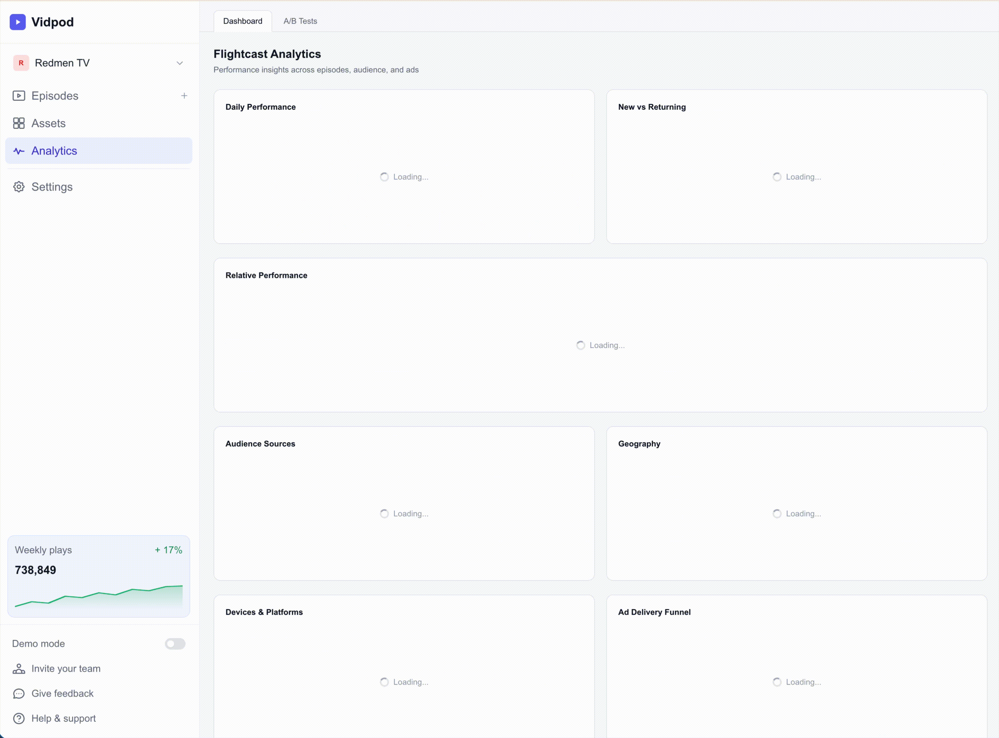
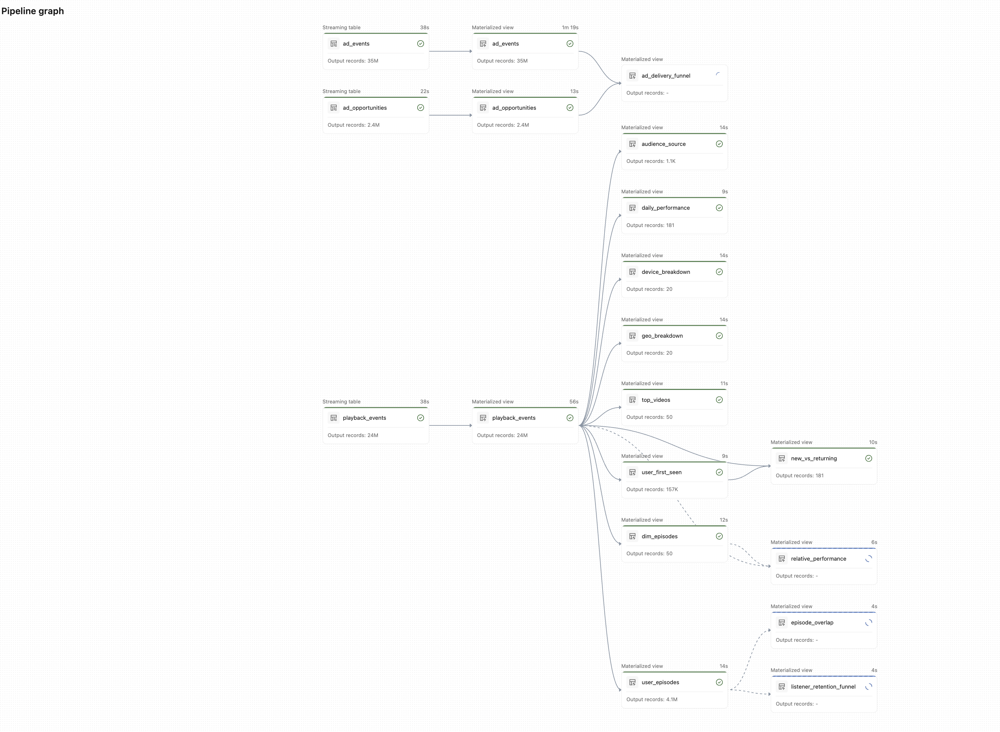

# Flightcast Analytics Engineering Proposal



---

## 1. Data Model

### 1.1 Source Event Tables

Three event streams capture all user and ad activity. At scale these tables hold billions of rows and are partitioned by `event_date` for efficient range scans.

#### `playback_events`
The core fact table. One row per user-view interaction.

| Column | Type | Description |
|--------|------|-------------|
| event_timestamp | TIMESTAMP | When the event occurred |
| event_date | DATE | Partition key (derived from timestamp) |
| show_id | STRING | Parent show identifier |
| video_id | STRING | Episode identifier |
| user_id_hash | STRING | Pseudonymized user identifier |
| provider | STRING | Platform: youtube, spotify, apple, rss |
| views | INT | Always 1 per event (count-ready) |
| watch_time_ms | BIGINT | Milliseconds of content consumed |
| likes | INT | 0 or 1 |
| comments | INT | 0 or 1 |
| shares | INT | 0 or 1 |
| country | STRING | ISO country code |
| device_type | STRING | mobile, desktop, tablet, smart_tv, smart_speaker |
| source | STRING | Traffic source: search, browse, direct, notification, external, playlist |

#### `ad_events`
Ad funnel progression events. Each row represents one stage in the ad lifecycle.

| Column | Type | Description |
|--------|------|-------------|
| event_timestamp | TIMESTAMP | When the ad event fired |
| event_date | DATE | Partition key |
| campaign_id | STRING | Campaign identifier |
| ad_id | STRING | Specific creative identifier |
| show_id | STRING | Show where ad played |
| video_id | STRING | Episode where ad played |
| event_type | STRING | Funnel stage: impression, start, first_quartile, midpoint, third_quartile, complete, click |
| country | STRING | ISO country code |

#### `ad_opportunities`
Ad slot availability and fill tracking.

| Column | Type | Description |
|--------|------|-------------|
| event_timestamp | TIMESTAMP | When the opportunity was evaluated |
| event_date | DATE | Partition key |
| show_id | STRING | Show identifier |
| video_id | STRING | Episode identifier |
| country | STRING | ISO country code |
| opportunities | INT | Available ad slots |
| filled | INT | Slots that served an ad |
| unfilled | INT | Slots left empty (= opportunities - filled) |

### 1.2 Derived Silver Tables

These intermediate tables are materialized to avoid repeated expensive computations across multiple gold rollups.

#### `user_episodes`
Distinct user-episode pairs (all-time). Deduplicated from playback_events. Used by Episode Overlap and Retention Funnel graphs.

| Column | Type |
|--------|------|
| user_id_hash | STRING |
| video_id | STRING |

#### `user_first_seen`
First event date per user. Defines "new" vs "returning."

| Column | Type |
|--------|------|
| user_id_hash | STRING |
| first_date | DATE |

#### `dim_episodes`
Episode dimension derived from event data (in production, sourced from a catalog API).

| Column | Type |
|--------|------|
| video_id | STRING |
| show_id | STRING |
| published_at | DATE |
| duration_ms | BIGINT |

### 1.3 Catalog Organization

Tables follow a medallion architecture across Unity Catalog catalogs:

```
bronze.flightcast.*   -- raw ingestion (append-only, schema-on-read)
silver.flightcast.*   -- cleaned, typed, deduplicated, validated
gold.flightcast.*     -- pre-computed rollups for each analytics graph
```

This isolates raw data from cleaned data from reporting, and scopes all Flightcast tables to their own schema within each catalog to avoid collisions with other pipelines.



---

## 2. Ingestion Approach

### 2.1 Landing Zone

Raw events arrive as Parquet files on S3 (`s3://flightcast-data/raw/`), partitioned by event_date:

```
raw/
  playback_events/event_date=2025-10-01/part-0000.parquet
  playback_events/event_date=2025-10-02/part-0000.parquet
  ad_events/event_date=2025-10-01/part-0000.parquet
  ...
```

Parquet gives columnar compression, schema enforcement, and predicate pushdown at read time.

### 2.2 Incremental Ingestion with Auto Loader

Bronze tables use Databricks Auto Loader (`cloudFiles` format) for streaming ingestion:

```python
spark.readStream
    .format("cloudFiles")
    .option("cloudFiles.format", "parquet")
    .option("cloudFiles.schemaLocation", "s3a://.../playback_events/_schema")
    .load("s3a://.../playback_events/")
```

Auto Loader tracks which files have been processed via a schema checkpoint, so it only reads new files on each pipeline run. This is critical at billions-of-rows scale: re-reading the entire dataset each time would be prohibitively expensive.

### 2.3 Data Quality

Silver layer applies two tiers of DLT expectations:

**Hard constraints** (`expect_all_or_drop`) -- rows that fail are dropped:
- `user_id_hash IS NOT NULL`
- `video_id IS NOT NULL`
- `views > 0`
- Valid ad event types

**Soft constraints** (`expect_all`) -- rows pass through but are flagged in pipeline metrics:
- `watch_time_ms >= 0`
- `provider IN ('youtube', 'spotify', 'apple', 'rss')`
- `filled <= opportunities`

### 2.4 Deduplication

Silver tables apply deterministic deduplication using window functions:

```sql
ROW_NUMBER() OVER (
    PARTITION BY user_id_hash, video_id, event_timestamp
    ORDER BY _ingested_at DESC
) = 1
```

This keeps the most recently ingested version of each logical event, handling late-arriving corrections and duplicate deliveries.

---

## 3. Queries Per Graph

### Graph 1: Episode Overlap

**Question:** Which episodes share the most audience?

**Approach:** Self-join on `user_episodes` where the same user watched both episodes. Constrain to `episode_a < episode_b` to avoid duplicates. Join back to per-episode user counts for overlap percentage.

```sql
SELECT a.video_id AS episode_a, b.video_id AS episode_b,
       COUNT(*) AS shared_users,
       ea.total_users AS users_in_a,
       ROUND(100.0 * COUNT(*) / ea.total_users, 1) AS overlap_percent
FROM user_episodes a
JOIN user_episodes b ON a.user_id_hash = b.user_id_hash
                     AND a.video_id < b.video_id
JOIN (SELECT video_id, COUNT(*) AS total_users FROM user_episodes GROUP BY 1) ea
  ON a.video_id = ea.video_id
GROUP BY 1, 2, 4
ORDER BY shared_users DESC
```

**Complexity note:** The self-join is O(n^2) on user-episode pairs in the worst case. At scale this is the most expensive query in the pipeline. Spark distributes the shuffle across workers; a single-threaded pandas approach is 8.8x slower at 24M rows (see benchmarks).

### Graph 2: Listener Retention Funnel

**Question:** How many users watched 1+, 2+, 3+, 5+, 10+ episodes?

**Approach:** Count distinct episodes per user, then cross-join with threshold buckets and filter.

```sql
WITH user_counts AS (
    SELECT user_id_hash, COUNT(DISTINCT video_id) AS episodes_watched
    FROM user_episodes GROUP BY 1
)
SELECT threshold || '+' AS bucket,
       COUNT(*) AS users,
       ROUND(100.0 * COUNT(*) / (SELECT COUNT(*) FROM user_counts), 1) AS pct
FROM (VALUES (1),(2),(3),(5),(10)) t(threshold)
CROSS JOIN user_counts
WHERE episodes_watched >= threshold
GROUP BY threshold
ORDER BY threshold
```

### Graph 3: New vs Returning Users

**Question:** Each day, how many unique users are new vs returning?

**Approach:** Join daily distinct users against `user_first_seen`. A user is "new" on the day their `first_date` equals the event date.

```sql
SELECT event_date AS day,
       SUM(CASE WHEN first_date = event_date THEN 1 ELSE 0 END) AS new_users,
       SUM(CASE WHEN first_date < event_date THEN 1 ELSE 0 END) AS returning_users
FROM (SELECT DISTINCT event_date, user_id_hash FROM playback_events) d
JOIN user_first_seen USING (user_id_hash)
GROUP BY 1 ORDER BY 1
```

### Graph 4: Relative Performance

**Question:** How do the latest 10 episodes compare fairly?

**Approach:** The "fairness rule" -- compare all episodes using only their first X days of data, where X is the age of the newest episode. This prevents older episodes from having an unfair advantage from accumulated views.

```sql
-- X = days since newest episode was published
-- For each episode, only count events within [published_at, published_at + X days)
-- Rank across 6 metrics: views, listens, likes, comments, shares, watch_time
```

The window is computed dynamically via `DATEDIFF(CURRENT_DATE, MAX(published_at))` across the latest 10 episodes. Metrics are unpivoted and ranked per metric.

### Graph 5: Daily Performance Trend

**Question:** How are views, listens, and watch time trending day over day?

```sql
SELECT event_date AS day,
       SUM(views) AS views,
       SUM(CASE WHEN provider != 'youtube' THEN views ELSE 0 END) AS listens,
       SUM(views) AS streams,
       SUM(watch_time_ms) AS watch_time
FROM playback_events
GROUP BY 1 ORDER BY 1
```

### Graph 6: Audience Source Breakdown

**Question:** Where is traffic coming from each day?

```sql
SELECT event_date AS day, source,
       SUM(views) AS views,
       ROUND(100.0 * SUM(views) / SUM(SUM(views)) OVER (PARTITION BY event_date), 1) AS share_percent
FROM playback_events
GROUP BY 1, 2 ORDER BY 1, 2
```

### Graph 7: Geography Breakdown

**Question:** Which countries drive the most engagement?

```sql
SELECT country,
       SUM(views) AS views,
       SUM(CASE WHEN provider != 'youtube' THEN views ELSE 0 END) AS listens,
       COUNT(DISTINCT user_id_hash) AS unique_users
FROM playback_events
GROUP BY 1 ORDER BY views DESC
```

### Graph 8: Device/Platform Breakdown

**Question:** How does engagement break down by device and platform?

```sql
SELECT device_type, provider AS platform,
       SUM(views) AS views,
       SUM(watch_time_ms) AS watch_time
FROM playback_events
GROUP BY 1, 2 ORDER BY views DESC
```

### Graph 9: Ad Delivery Funnel

**Question:** How efficiently are ad slots being filled and completing?

**Approach:** Join daily ad opportunity aggregates with daily ad event aggregates (impressions and completions). Compute fill rate as impressions/opportunities.

```sql
SELECT COALESCE(o.day, a.day) AS day,
       COALESCE(opportunities, 0) AS opportunities,
       COALESCE(impressions, 0) AS impressions,
       COALESCE(completions, 0) AS completions,
       ROUND(100.0 * impressions / NULLIF(opportunities, 0), 1) AS fill_rate
FROM (SELECT event_date AS day, SUM(opportunities) AS opportunities, SUM(filled) AS filled_slots
      FROM ad_opportunities GROUP BY 1) o
FULL OUTER JOIN (
    SELECT event_date AS day,
           SUM(CASE WHEN event_type = 'impression' THEN 1 ELSE 0 END) AS impressions,
           SUM(CASE WHEN event_type = 'complete' THEN 1 ELSE 0 END) AS completions
    FROM ad_events GROUP BY 1
) a ON o.day = a.day
ORDER BY 1
```

### Graph 10: Top Videos

**Question:** Which episodes have the highest total consumption?

```sql
SELECT video_id,
       SUM(views) AS views,
       SUM(CASE WHEN provider != 'youtube' THEN views ELSE 0 END) AS listens,
       SUM(watch_time_ms) AS watch_time,
       RANK() OVER (ORDER BY (SUM(views) + SUM(CASE WHEN provider != 'youtube' THEN views ELSE 0 END) + SUM(views)) DESC) AS rank
FROM playback_events
GROUP BY 1 ORDER BY rank
```

---

## 4. Scale Considerations

### Why Spark over pandas

At 24 million rows on the same hardware, Spark consistently outperforms single-threaded pandas:

| Operation | Pandas | Spark | Speedup |
|-----------|--------|-------|---------|
| Daily multi-metric aggregation | 11.95s | 2.84s | **4.2x** |
| Episode overlap (self-join) | 46.12s | 5.22s | **8.8x** |
| Window-based deduplication | 34.05s | 9.02s | **3.8x** |

At billions of rows, pandas would fail entirely (OOM), while Spark scales horizontally by adding workers.

### Key design decisions for scale

1. **Partitioning by event_date** -- enables partition pruning for date-range queries, which is the dominant access pattern for trend graphs (3, 5, 6, 9).

2. **Pre-computed gold tables** -- the 10 gold rollup tables are materialized, not computed on-the-fly. Dashboard reads hit pre-aggregated tables with hundreds to thousands of rows, not billions.

3. **Incremental ingestion** -- Auto Loader processes only new files, not the full history. A daily batch of ~130K playback events takes seconds, not the minutes required to re-scan billions of historical rows.

4. **Intermediate silver tables** -- `user_episodes` and `user_first_seen` are materialized once and shared across multiple gold rollups, avoiding redundant scans of the full playback events table.

5. **Deterministic deduplication** -- Window-function dedup (`ROW_NUMBER ... ORDER BY _ingested_at DESC`) is deterministic and handles late-arriving data correctly, unlike `DROP DUPLICATES` which is non-deterministic about which row survives.

---

## 5. Production Event Ingestion

In production, events would flow through an AWS streaming pipeline before reaching the DLT layer described above:

```
Client SDKs (web, mobile, smart TV)
    |
    v
Amazon Kinesis Data Streams
    |
    v
Amazon Kinesis Data Firehose (5-minute buffer window)
    |
    v
S3 (Parquet, partitioned by event_date and hour)
    |
    v
Databricks Auto Loader (detects new files, ingests incrementally)
```

Each platform SDK emits playback and ad events to a Kinesis stream. Firehose consumes from Kinesis, buffers records for 5 minutes (or 128MB, whichever comes first), converts to Parquet using a Glue schema, and flushes to S3 under a predictable partition layout like `s3://flightcast-data/raw/playback_events/event_date=2025-10-15/hour=14/`.

Auto Loader in the DLT pipeline monitors the S3 prefix via file notification (SQS subscription on the bucket). When Firehose drops a new batch, Auto Loader picks it up within seconds and streams it through bronze/silver/gold. The pipeline can run continuously or on a triggered schedule depending on latency requirements.

This gives near-real-time analytics (5-10 minute lag) without any custom orchestration. Firehose handles backpressure, retries, and format conversion. Auto Loader handles exactly-once file tracking. The DLT pipeline handles dedup, validation, and rollup computation.

For this demo, a Python generator simulates the same output Firehose would produce (Parquet files partitioned by date on S3), so the DLT pipeline code is identical to what would run in production.

---

## 6. Working Demo

A complete end-to-end implementation accompanies this proposal. The demo generates synthetic data (24M playback events, 35M ad events across 181 days), processes it through the DLT pipeline on Databricks, exports gold rollups as JSON to S3, and serves them to a Next.js dashboard with 10 Recharts visualizations.

The repo is structured to work out of the box: S3 credentials for the read-only demo bucket are embedded, so `npm run dev` renders live analytics data without any AWS configuration.

Key files:

```
pipeline/
  flightcast_pipeline.py       -- dlt pipeline (bronze/silver/gold)
  stream_to_s3.py              -- synthetic data generator
  config.py                    -- episode/user/distribution config
  export_gold_to_s3.py         -- gold to json to s3 exporter
  benchmark_spark_vs_pandas.py -- spark vs pandas benchmark
  benchmark_results.txt        -- benchmark output (24M rows)

src/
  lib/s3Client.ts              -- s3 fetch with 5-min cache
  app/api/analytics/           -- 10 api route handlers
  components/analytics/charts/ -- 10 recharts components
```
